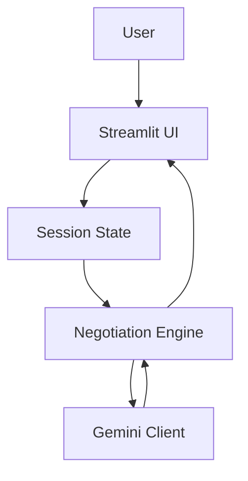

# Architecture

Documentation will be expanded in Phase 7. The Phase 1 boundary is Streamlit UI -> session state -> negotiation engine -> cached Gemini client.

```mermaid
flowchart TD
    User --> StreamlitUI[Streamlit UI]
    StreamlitUI --> State[Session State]
    State --> Engine[Negotiation Engine]
    Engine --> Gemini[Gemini Client]
    Gemini --> Engine
    Engine --> StreamlitUI
```
